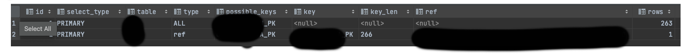
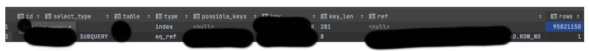
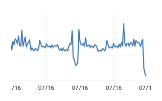

## MariaDB에서 Update-Where Exists 절과 Select-Where Exists 절의 플랜이 다를 때

아래와 같이 특정 조건에 부합하는 행의 데이터 마이그레이션이 필요 한 약 1억건의 행을 보유 한 테이블이 있을 때
```sql
create table MY_DATA
(
    KEY        int,
    ITEM_ID    varchar(64),
    LAT        int(6),
    LON        int(6),
    MER        int(6),
    INPUT_TIME timestamp(6) default current_timestamp(6),
    VALUE      varchar(4000),
    constraint MY_DATA_PK
        unique (KEY, ITEM_ID, LAT, LON, MER, INPUT_TIME),
);
```

데이터 변경이 필요해서 아래와 같이 exists 절을 이용 했다.  
```sql
UPDATE MY_DATA MD
SET VALUE      = 'MIG_DAT',
    INPUT_TIME = NOW(),
    REASON     = '...'
WHERE EXISTS(
        SELECT 1
        FROM BASE_TAB BT
        WHERE COL1 IS NOT NULL
          AND COL2 != '' 
          AND COL3 = 'N'
          AND MD.KEY = BT.KEY
          AND MD.LAT = BT.LAT
    )
  AND MD.ITEM_ID = 'TARGET_ITEM_ID'
  ;
```
'TARGET_ITEM_ID'외의 다른 아잍엠은 17분, 20분 정도의 소요시간이 걸렷으나   
특정 아이템의 경우 50분이 넘어도 종료되지 않는 문제가 발생 했다. (한번 더 실행하고 기다렸는데 40분 뒤에 커넥션이 끊겼다.)   
결국 데이터 이관 건은 보류 되었다.  

추후 50분이 넘게 소요 됐던 조건의 데이터의 건 수를 확인해보았는데 0건이었다.  
왜 이런 일이 발생 햇을까?  

Select 쿼리의 실행 계획을 보면 아래와 같다.    
  
접근 순서를 보면 1이 BASE_TAB이고 2가 MY_DATA로 의도 한대로 실행 계획이 잡혀있다.  

반면 Update 쿼리의 실행 계획은 아래와 같았다.  
  
접근 순서를 보면 1이 MY_DATA가 2가 BASE_TAB이다. 또한 대량 데이터가 있는 MY_DATA에서 possible_keys가 없어  
1억 건에 가까운 전체 행을 훑도록 실행계획이 잡혀 있는 것을 볼 수 있다.  

50분이 걸린 시점에 CPU 모니터링은 어땠을까? 아래와 같이 오히려 잔잔했다.     
  
50분 동안 풀스캔이 도는데 CPU 점유율이 낮았다는 것은 무언가 문제가 있는 상황이었을 것인데  
위 계측으로 보면 옵티마이저가 UPDATE-EXISTS 쿼리를 1억건에 가까운 행을 훑도록 실행계획을 내렸고  
부하가 클 것으로 판단하여 해당 쿼리의 실행을 최대한 뒤로 늦췄을 것이라고 판단한다.  

그렇기 때문에 show processlist에서 락만 잡고 있을 뿐 실제 실행은 되지 않는 상태가 지속 되어 50분, 40분 동안 기다리기만 한 것으로 보인다.  
해결은 어떻게 해야 할까?  

단순하게 아래와 같이 JOIN을 걸었다.  
실행 계획도 SELECT 절과 동일하게 탔다.  
```sql
UPDATE MY_DATA MD
  INNER JOIN (
    SELECT * FROM BASE_TAB
    WHERE COL1 IS NOT NULL
      AND COL2 != '' 
      AND COL3 = 'N'
  ) BT ON BT.KEY = MD.KEY AND BT.LAT = MD.LAT 
SET VALUE      = 'MIG_DAT',
    INPUT_TIME = NOW(),
    REASON     = '...'
WHERE MD.ITEM_ID = 'TARGET_ITEM_ID'
;
```

음.. 그냥 뭐 몇시간씩 대기한게 아까웠던 기억에 정리해 내용... 